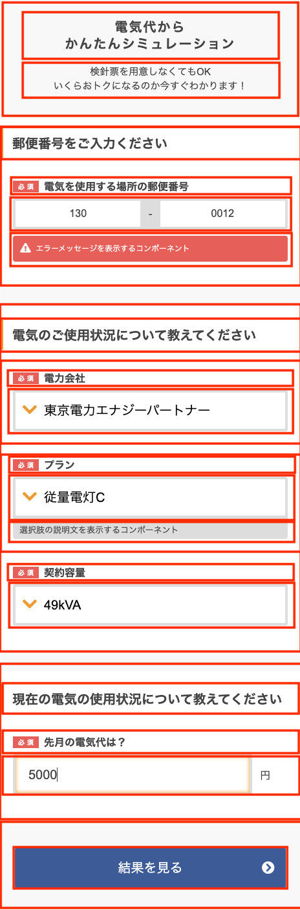

# Issue

- ~~Atomic DesignっぽくHTML要素を分解する~~
- ~~OpenAPIでAPI仕様書を作成する~~
  - ~~電力会社検索 APIエンドポイント~~
  - ~~プラン検索 APIエンドポイント~~
- ~~json-serverでAPIモックサーバを作成する~~
- ~~StorybookでUIを管理できるようにする~~
- HTML要素の作成
  - Atoms要素
    - ~~ページタイトル~~
    - ~~ページディスクリプション~~
    - ~~セクションタイトル~~
    - ~~入力項目タイトル~~
    - ~~選択肢の説明文を表示するコンポーネント~~
    - ~~エラーメッセージ~~
    - ~~サブミットボタン~~
    - ~~テキスト~~
    - ~~セレクトボックス~~
    - ~~郵便番号~~
  - Molecules
    - ~~以下をセットにする~~
      - ~~入力項目タイトル~~
      - ~~選択肢の説明文を表示するコンポーネント~~
      - ~~エラーメッセージ~~
      - ~~入力項目~~
  - Section
    - ~~ヘッダー~~
    - ~~Submit~~
    - ~~郵便番号~~
    - ~~使用状況~~
    - ~~現在の使用状況~~
  - ページ
    - ~~シュミレーション~~
- 動的処理の実装
  - 郵便番号入力
    - エネルギー会社の一覧 API 呼び出し
    - 電力会社 セレクトボックス オプション 出し分け

# 技術的な決定事項

- フレームワーク : nuxtjs を採用
- mockサーバ : json-server を採用
- UI管理 : Storybook を採用

# HTML作成時の要素分解についての検討

分解する要素を赤枠として検討する。

[必須] も要素として分解するか。Flagで持たせるべきか

